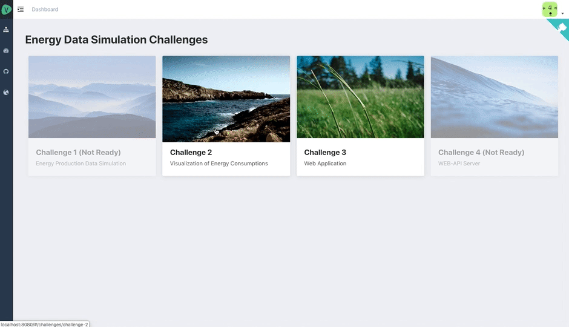
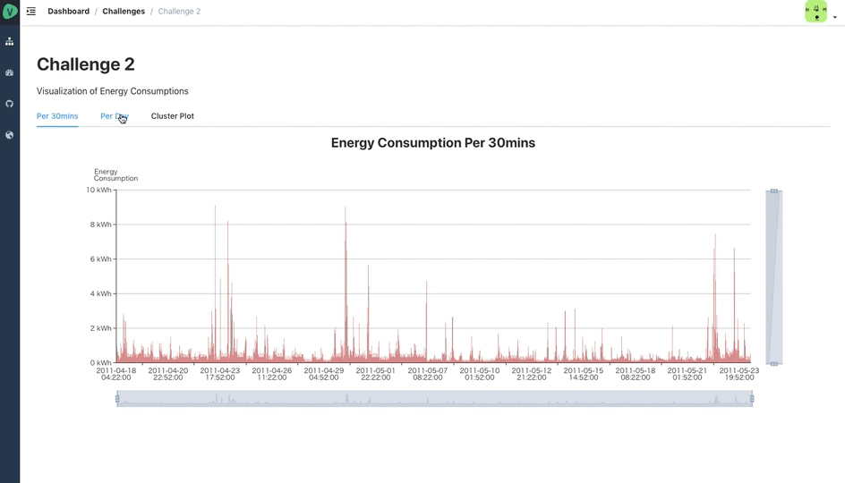
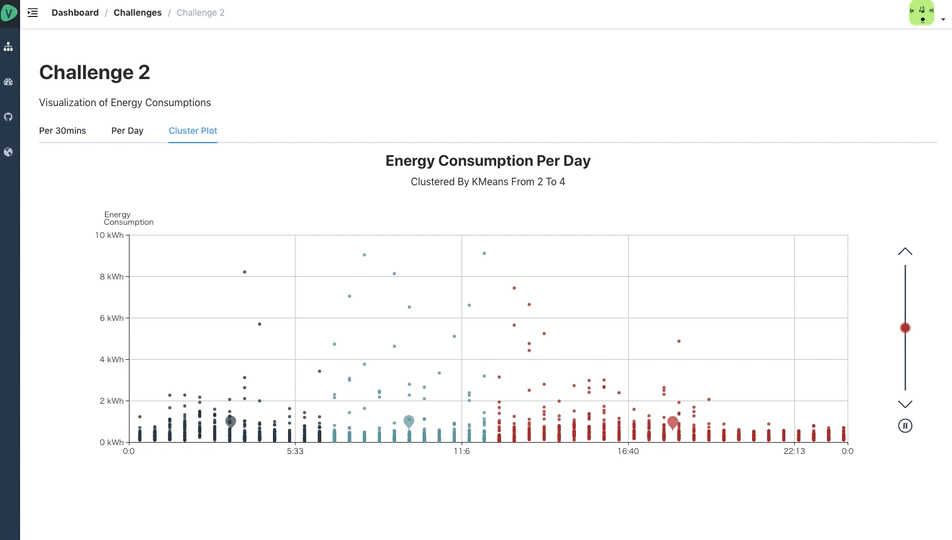

<h1 align="center">Iuliana Challenges</h1>

This is a web app for exhibiting **[EnergyDataSimulationChallenge](https://github.com/camenergydatalab/EnergyDataSimulationChallenge)** challenges


[](https://opensource.org/licenses/MIT)
[](Ruby)

## Introduction

**DEMO: https://iuliana-challenges.herokuapp.com**

**Attention: Source Codes of Challenge 2 placed in [`challenge3/webapp/caesaris`](../../../challenge3/webapp/caesaris)**

And *Challenge 2 Special Logics* are mainly in  
[`challenge3/webapp/caesaris/vendor/admin/src/views/challenges/challenge-2/`](../../../challenge3/webapp/caesaris/vendor/admin/src/views/challenges/challenge-2)

### Locate Application
```sh
EnergyDataSimulationChallenge/
  ├─ README.md
  ├─ challenge1/
  ├─ challenge2/
  │    ├─ data/
  │    └─ analysis/
  │         └─ caesaris/ # <= You Are Here Now!
  │
  ├─ challenge3/
  │    ├─ data/
  │    └─ webapp/
  │         └─ caesaris/ # <= Try To Go Here!
  │
  └─ challenge4/

vendor/admin
```

### Locate Challenge 2 Logics
The root path is `EnergyDataSimulationChallenge/challenge3/webapp/caesaris`

```sh
caesaris/
  ├─ README.md
  ├─ app/
  │ # ... A lot of Rails Files
  └─ vendor/
      └─ admin/
          ├─ package.json
          │ # ... A lot of JS Files
          └─ src/
              └─ views/
                  └─ challenges
                      └─ challenge-2 # <= Challenge 2 Mainly In Here
```


## Challenges
### Challenges 2
#### Energy Consumption Per 30mins


#### Average Energy Consumption Per Day
**Clustered By KMeans**  


#### Energy Consumption Per Day
**Clustered By KMeans From 2 To 4**  

