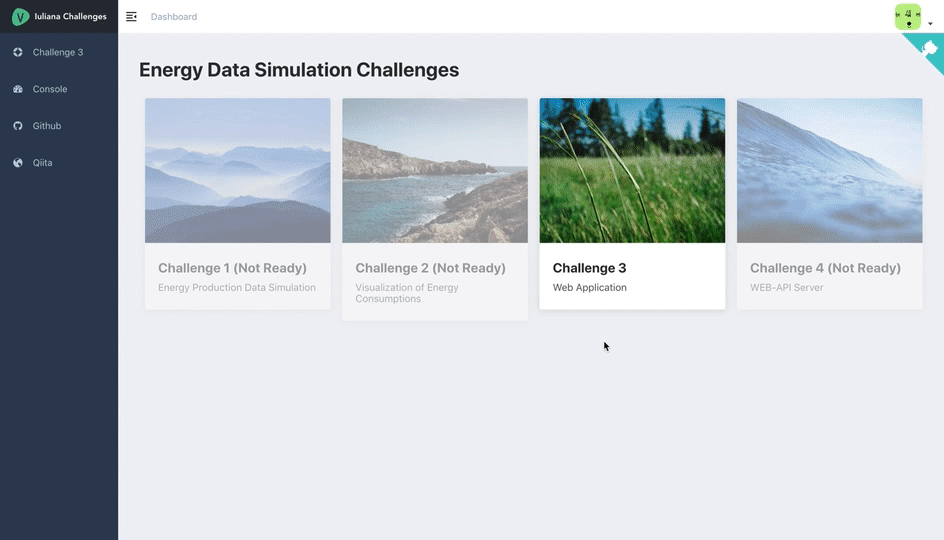
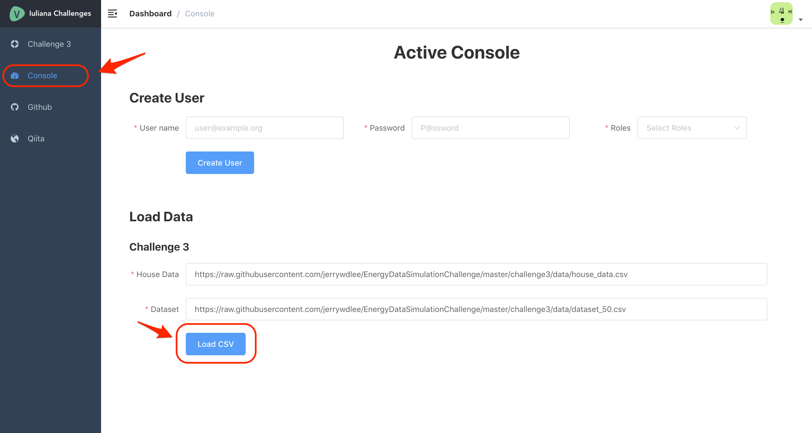

<h1 align="center">Iuliana Challenges</h1>

This is a web app for exhibiting **[EnergyDataSimulationChallenge](https://github.com/camenergydatalab/EnergyDataSimulationChallenge)** challenges


[](https://opensource.org/licenses/MIT)
[](Ruby)

## Introduction
### Local Install (development)
#### Dependencies
- postgresql >= 10.2
- ruby: >= 2.6.1
- bundler: >= 2.0.0
- nodejs: >= 8.0
- yarn: >= 1.13.0
- docker: >= 17.12.0

#### Command Cheat Sheet
##### Setup Rails Part
*Set `EnergyDataSimulationChallenge/challenge3/webapp/caesaris` As Root Path*

```sh
$ bundle install
$ bundle exec rails db:create
$ bundle exec rails db:migrate
$ bundle exec rails s
# page will shown on localhost:18000
```

**Default User**  

```
Username: admin@example.com
Password: admin2019
```

##### Setup Admin(Vue.js) Part
Admin part is based on [Vue Element Admin](https://github.com/PanJiaChen/vue-element-admin) and [Vue Typescript Admin Template](https://github.com/Armour/vue-typescript-admin-template), special thanks.

*Set `EnergyDataSimulationChallenge/challenge3/webapp/caesaris/vendor/admin` As Root Path*

```sh
$ yarn install
$ yarn serve
# page will shown on localhost:8080
```

**Add New SVG Icons**  

```sh
$ cp YOUR_ICON.svg ./src/icons/svg
$ npx vsvg -s ./src/icons/svg -t ./src/icons/components --ext ts --es6
```

##### Tests on Rails Part
*Set `EnergyDataSimulationChallenge/challenge3/webapp/caesaris` As Root Path*

```sh
$ bundle exec rspec
# Coverage in `caesaris/coverage`
# Coverage(2019-06-24): 97.51%
```

##### Tests on Admin(Vue.js) Part
*Set `EnergyDataSimulationChallenge/challenge3/webapp/caesaris/vendor/admin` As Root Path*

```sh
$ yarn test:unit
# Coverage in `tests/unit/coverage`
# Coverage(2019-06-24): 94.12%, WIP
```

### Deployment (production)
#### Deploy Directly
*Set `EnergyDataSimulationChallenge/challenge3/webapp/caesaris` As Root Path*

- Install Postgres and set `POSTGRES_USERNAME`, `POSTGRES_PASSWORD`
- Set `SECRET_KEY_BASE` by `bundle exec rake secret`

```sh
$ bundle install
$ cd vendor/admin; yarn install; cd -
$ bundle exec rails db:create
$ bundle exec rails db:migrate
$ bundle exec rake assets:precompile
$ bundle exec rails s -b 0.0.0.0
# bond nginx to `localhost:18000`
# Admin(Vue.js) will be built and serve by Rails server
```

#### Deploy By Docker
*Set `EnergyDataSimulationChallenge/challenge3/webapp/caesaris` As Root Path*

```sh
$ echo "POSTGRES_USERNAME=${YOUR_DB_USERNAME}" >> .env
$ echo "POSTGRES_PASSWORD=${YOUR_DB_PASSWORD}" >> .env
$ echo "SECRET_KEY_BASE=`bundle exec rake secret`" >> .env
$ docker-compose build
# Run Database Migration in Docker
$ docker-compose run web bundle exec rake db:create
$ docker-compose run web bundle exec rake db:migrate
$ docker-compose up -d
# bond nginx to `localhost:38000`
# Admin(Vue.js) will be built and serve by Rails server
```

## Challenges

### Challenges 1
***WIP***

### Challenges 2
***WIP***

### Challenges 3
#### Abstract


#### Init Datasets


### Challenges 4
***WIP***

## [MIT LICENSE](vendor/admin/LICENSE)
Copyright (c) 2019 Iuliana Caesaris Augusta
