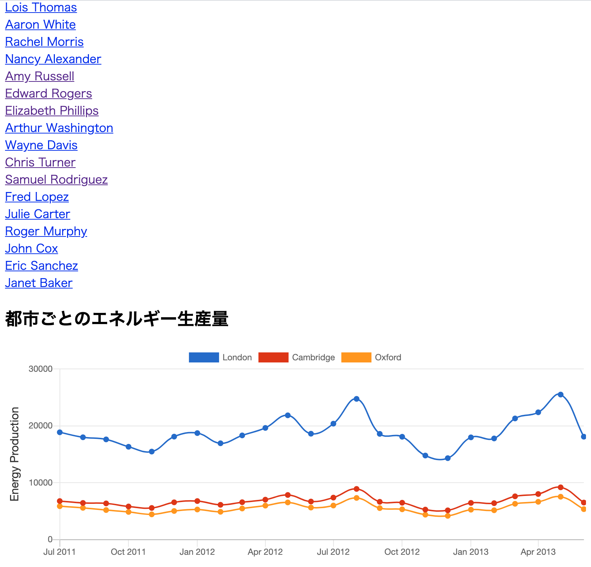
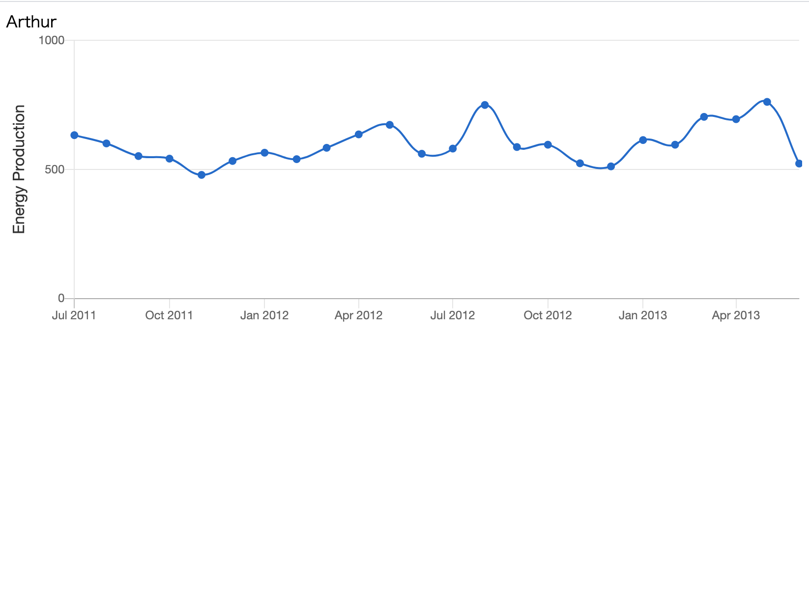

# アクセス

http://54.250.88.80/

# 機能

- seed ファイルによる csv データの DB 登録
- ユーザー一覧表示
- グラフ表示１・・・ユーザごとのエネルギー生産量の推移グラフ
- グラフ表示２・・・都市ごとのエネルギー生産量の推移グラフ
- 本番環境・・・web/アプリサーバ puma+nginx, docker-compose によるコンテナ起動, サーバ：EC2

# 不十分な点と改善案

- compose 実行時に docker image が生成される仕様のため、アプリディレクトリまるごと必要。->ローカルでイメージ作成。docker-compose は dockerhub からイメージをダウンロードして起動する仕様とする
- グラフ表示 2 のための変数が map メソッドによる配列となっており、rails の書き方になっていない->データベースなしモデルの定義+rails ヘルパーメソッドの組み合わせで工夫して表示
- 追加する機能・・・csv アップロード → データ反映 機能

# スクリーンショット

### トップページ

### 顧客個別ページ

